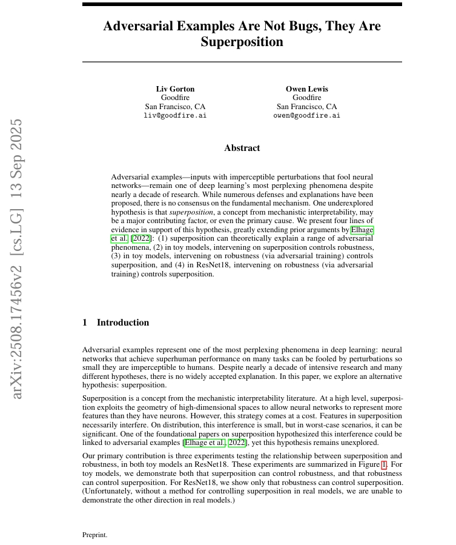

# Robustness-Superposition-causality
Replication of "Adversarial Examples Are Not Bugs, They Are Superposition" [paper](https://arxiv.org/pdf/2508.17456).

<br>
  
<p align="center">
  
</p>
<br>


<br>


## Setup
```bash
pip install -r requirements.txt
```

## Requirements
```
torch
numpy
```
---

## Running Experiments
 
### Experiment 3.2 — Superposition → Robustness
Train models cleanly at varying sparsity levels, test on attacks, measure how superposition affects vulnerability.
 
```bash
python main.py --experiment "superposition->robustness"
```
 
With custom arguments:
```bash
python main.py --experiment "superposition->robustness" --epochs 1900 --batch_size 64 --seed 52
```
 
### Experiment 3.3 — Robustness → Superposition
For each sparsity level, train one clean and one adversarial model, measure how robustness intervention affects superposition.
 
```bash
python main.py --experiment "robustness->superposition"
```
 
With custom arguments:
```bash
python main.py --experiment "robustness->superposition" --epochs 1900 --batch_size 64 --seed 42
```
 
