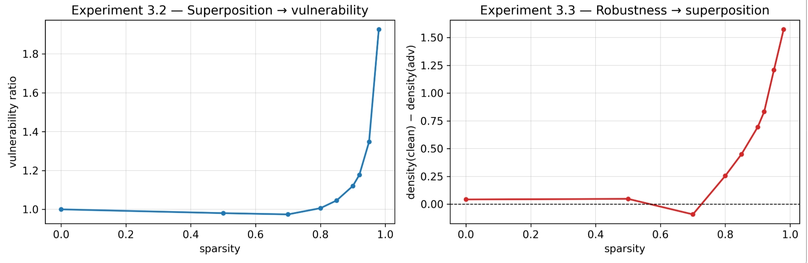

# Robustness-Superposition-causality
Replication of "Adversarial Examples Are Not Bugs, They Are Superposition" [paper](https://arxiv.org/pdf/2508.17456).

<br>
  
<p align="center">
  
</p>
<br>

<br>

## Remarks on Experimental Presentation

### Section 3.2 — Superposition acting on robustness

Section 3.2 lacks dedicated plots for the vulnerability trend. The vulnerability curve is not presented as a standalone figure but is instead embedded alongside other measurements, making it harder to isolate and interpret the core claim of this section independently.

> Here are two simple plots for the experiments:

<br>
  
<p align="center">
  
</p>
<br>

<br>

### Section 3.3 — Robustness acting on superposition

The figures in section 3.3 combine results from both 3.2 and 3.1 in the same plots, presenting superposition measurements from clean and adversarially trained models alongside the vulnerability curve from 3.2. This conflation makes it ambiguous which results belong to which experimental claim and complicates direct interpretation of the bidirectional causality argument.

### Vulnerability metric

The paper describes the vulnerability metric in prose , but never specifies it as an explicit formula which can lead to some confusion. In this replication we operationalize it as:

$$\text{vulnerability}(S) = \frac{\text{loss}_{\text{adv}}(S) / \text{loss}_{\text{clean}}(S)}{\text{loss}_{\text{adv}}(S=0) / \text{loss}_{\text{clean}}(S=0)}$$

This normalizes the adversarial-to-clean loss ratio at each sparsity level against the baseline ratio at zero sparsity, which is critical and scale invariant given that their attack budget is computed as 10% of the average input norm which scales down with sparsity.

## Setup
```bash
pip install -r requirements.txt
```

## Requirements
```
torch
numpy
```
---

## Running Experiments
 
### Experiment 3.2 — Superposition → Robustness
Train models cleanly at varying sparsity levels, test on attacks, measure how superposition affects vulnerability.
 
```bash
python main.py --experiment "superposition->robustness"
```
 
With custom arguments:
```bash
python main.py --experiment "superposition->robustness" --epochs 1900 --batch_size 64 --seed 52
```
 
### Experiment 3.3 — Robustness → Superposition
For each sparsity level, train one clean and one adversarial model, measure how robustness intervention affects superposition.
 
```bash
python main.py --experiment "robustness->superposition"
```
 
With custom arguments:
```bash
python main.py --experiment "robustness->superposition" --epochs 1900 --batch_size 64 --seed 42
```
 
